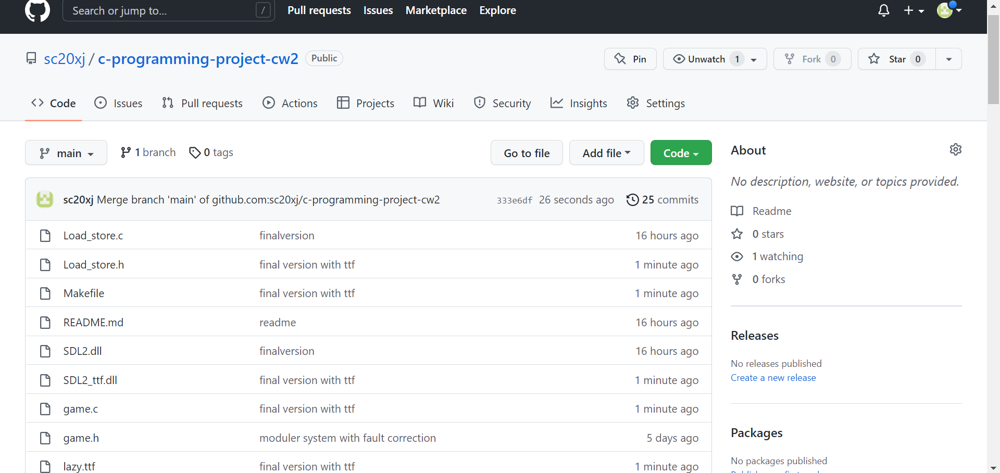
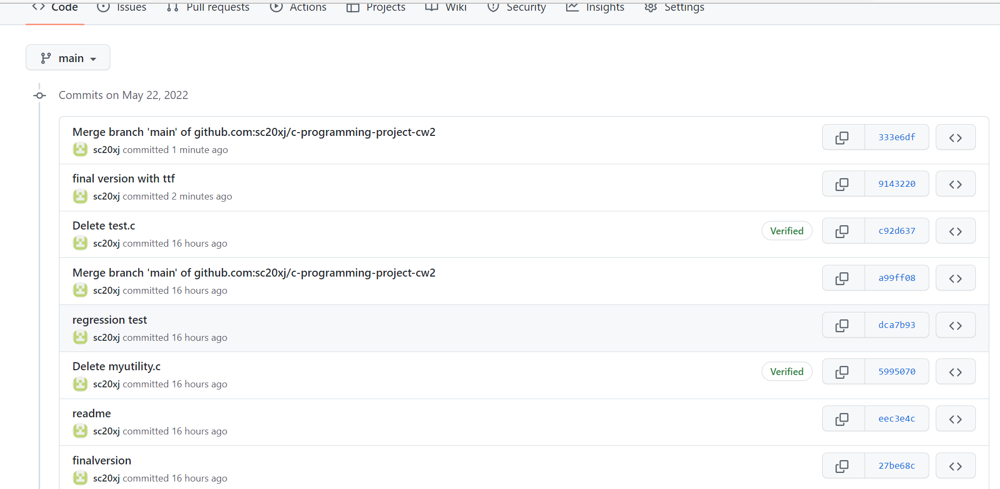

# c-programming-project-cw2

URL of git:https://github.com/sc20xj/c-programming-project-cw2

usage: use make file to complie the whole project and get the life execution, user also need to input a filename like "my.txt" as the beginning file and also
the storage file, if the file is not exist the program will exit.
You also need to install SDL2 and SDL ttf 2.0.18
When the size of the board that both width and height larger or equal to 40, there will be ttf visualiztion to tell the generation number.

example: windows: life my.txt
         Linux: ./life my.txt

