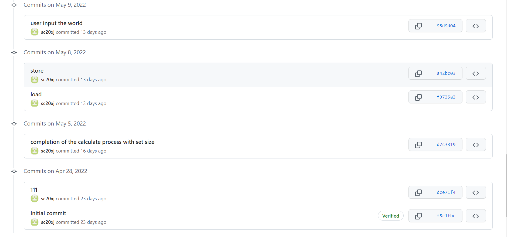
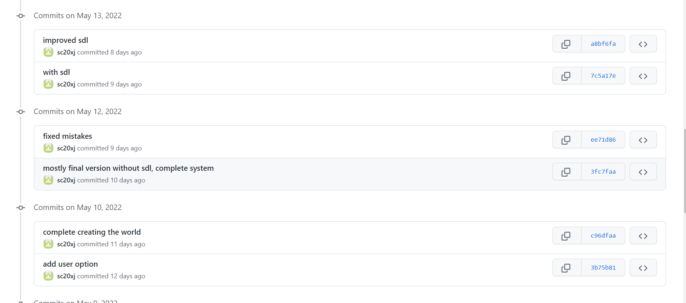
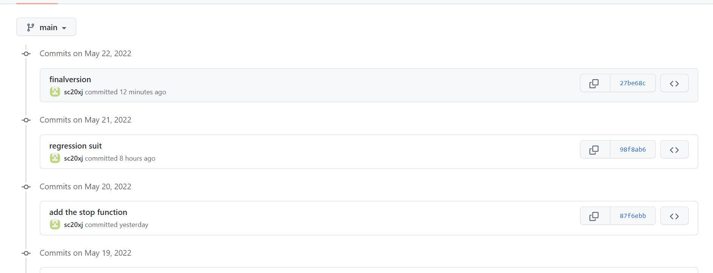
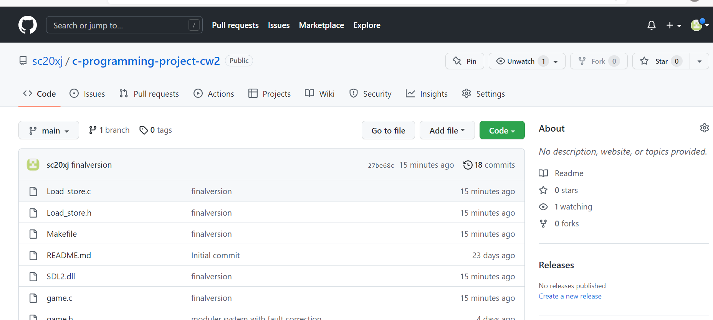

# c-programming-project-cw2

URL of git:https://github.com/sc20xj/c-programming-project-cw2

usage: use make file to complie the whole project and get the life execution, user also need to input a filename like "my.txt" as the beginning file and also
the storage file, if the file is not exist the program will exit.

example: windows: life my.txt
         Linux: ./life my.txt

